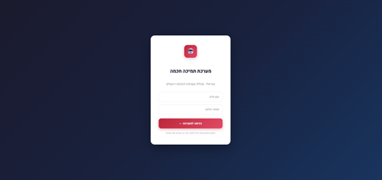
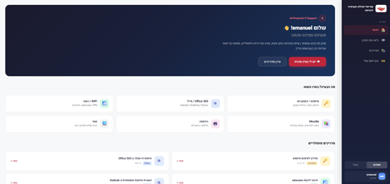
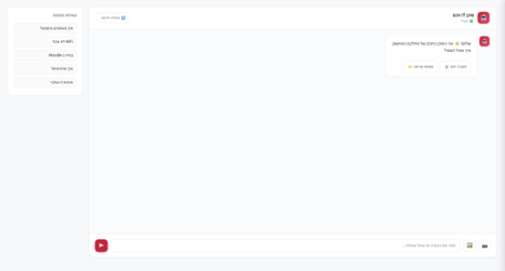
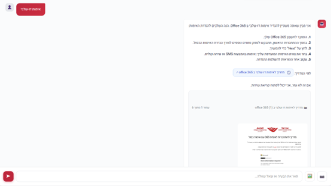
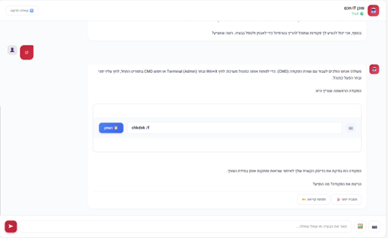
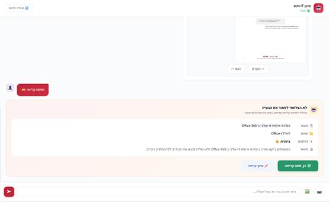
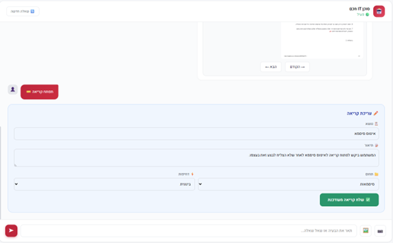
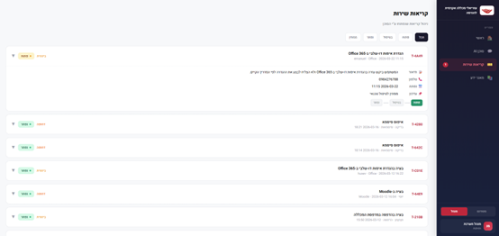
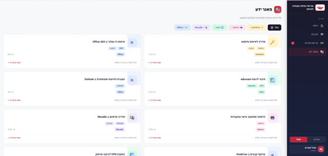

# IT Support Agent - Azrieli College of Engineering

An AI-powered IT support chatbot built as a final project for the "Programming in a Generative AI Environment" course, Department of Industrial Engineering and Management, Azrieli College of Engineering, Jerusalem.

> **Note:** This is an academic proof-of-concept. It was built to demonstrate how an AI agent could serve as a first line of IT support in a college setting. It uses real IT guides from Azrieli College of Engineering but was never deployed in the actual IT department.

## What It Does

A student opens the app, enters their name, and starts chatting. They can jump straight into a conversation or pick a topic first (passwords, Office 365, WiFi, Moodle, printing, or other) to get more focused help. The agent searches the college's actual IT guide PDFs, pulls relevant steps and screenshots, and walks the student through the solution. When the agent identifies that a diagnostic or fix command could help, it suggests terminal commands the student can copy and run directly. When the agent can't resolve the issue on its own, it drafts a support ticket - the student reviews the details, edits if needed, and confirms before it's submitted.

The app has two roles. Students get the chat and knowledge base. Admins get a dashboard to manage all incoming tickets - filter by status, expand details, and update progress. In this demo, switching between roles is a toggle in the sidebar so both interfaces can be explored easily. In a real deployment, these would be separate interfaces with proper authentication. All agent activity is traced via LangSmith for monitoring and debugging.

The whole thing runs from a single Google Colab notebook and is exposed to the internet through a Cloudflare Tunnel.

## Screenshots

### Login



### Home - Topic Selection and Popular Guides



### Chat - Getting Started with FAQ Suggestions



### Chat - RAG Response with PDF Guide and Image Carousel



### Chat - Terminal Commands with Copy Button



### Human-in-the-Loop - Ticket Confirmation



### Human-in-the-Loop - Editing Ticket Details



### Admin - Ticket Management Dashboard



### Knowledge Base - Browsable IT Guides



## Architecture

```
User (Browser)
    |
    v
NiceGUI Web Interface (port 8090)
    |
    +-- Cloudflare Tunnel (public HTTPS URL)
    |
    v
LangGraph Agent (state machine)
    |
    +-- Router Node ---- classifies request type and complexity
    +-- Answer Node ---- GPT-4o generates a response using tools
    +-- Tool Node ------- retrieve (RAG), tavily_search, ticket tools
    +-- Critic Node ----- scores response quality, retries if needed
    +-- HITL Node ------- human approval before creating tickets
    +-- Finalize Node --- saves confirmed tickets to Supabase
    |
    +-- LangSmith (tracing and debugging all agent runs)
```

The agent is built as a LangGraph state machine with conditional edges. Each user message first goes through a **router** that classifies the request type (password, network, office, moodle, printing, admin, general) and complexity (simple, medium, complex). The **answer node** then calls GPT-4o with the right tools. After generating a response, a **critic node** scores the quality and can send it back for another attempt if the answer is too short or empty. If the agent decides it can't solve the problem, it enters a **HITL (human-in-the-loop) node** where the student reviews and approves a support ticket before it gets created in the database.

## Tech Stack

| Component | Technology |
|-----------|-----------|
| LLM | GPT-4o via LangChain |
| Agent Framework | LangGraph with router, critic, and HITL nodes |
| Vector Store | ChromaDB (text + images extracted from PDFs) |
| Web Search | Tavily API |
| Database | Supabase (PostgreSQL - tickets, sessions, activity log) |
| Web UI | NiceGUI with custom HTML/CSS and a JS bridge |
| Tunnel | Cloudflare Tunnel (from Google Colab) |
| Monitoring | LangSmith (agent tracing and debugging) |
| PDF Processing | PyMuPDF + PyPDF |

## Features

### Chat
- Students can start chatting immediately or pick a topic for more focused help
- The agent searches college IT guide PDFs first (RAG with ChromaDB), falls back to web search if nothing relevant is found, and uses general knowledge as a last resort
- Responses include images extracted from the original PDF guides, displayed in a navigable carousel with prev/next buttons
- When the agent identifies that a command could help diagnose or fix the issue, it suggests terminal commands rendered as copyable code blocks
- FAQ suggestions appear in a sidebar panel to help students phrase their question
- Students can mark their issue as resolved to close the session
- Each chat session is tracked in Supabase with response time metrics
- "New question" button resets the conversation for a fresh start

### Human-in-the-Loop Tickets
- When the agent can't solve the problem, it proposes opening a support ticket
- The student sees a pre-filled card with subject, category, priority, and description
- They can approve it directly or open an edit form to change any field
- Confirmed tickets are saved to Supabase with the student's contact info and timestamps

### Admin Dashboard
- Lists all tickets with color-coded status badges (open, in progress, resolved, waiting)
- Expandable cards showing full description, phone number, timestamps, and ticket ID
- Status filter buttons across the top
- Direct status updates from within the dashboard

### Knowledge Base
- Browsable collection of IT guides pulled from the college's actual support site
- Search and filter by category (passwords, Office, WiFi, Moodle, printing)
- Each guide shows view count, tags, and a direct link to the full PDF
- Links point to the real Azrieli College of Engineering support portal (support.jce.ac.il)

### Role Switching (Demo)
- In this proof-of-concept, a sidebar toggle lets you switch between the student and admin views to demonstrate both interfaces
- In a real deployment, these would be separate interfaces with proper authentication - here they are combined for easy demonstration
- Each role maintains its own chat history and state - switching back doesn't lose context

## Notebook Structure

The entire project lives in one Google Colab notebook (18 cells):

| Cell | What It Does |
|------|-------------|
| Header | Project title (Markdown) |
| 1-3 | Installs all packages, pins uvicorn version, downloads Cloudflare binary |
| 4-5 | Mounts Google Drive, loads API keys (OpenAI, Tavily, Supabase, LangSmith) |
| 6-7 | Applies nest_asyncio patch, starts the Cloudflare tunnel |
| 8 | All Python imports |
| 9 | Loads IT guide PDFs from Drive, extracts text + images, builds ChromaDB vector store |
| 10 | Defines agent tools: `retrieve` (RAG), `tavily_search`, `list_tickets`, `update_ticket`, `delete_ticket`, `ProposeTicket` |
| 11 | Configures GPT-4o, defines `AgentState` (with router/critic fields), writes the system prompt |
| 12 | Builds the LangGraph graph: router -> answer -> tools -> critic -> HITL -> finalize |
| 13 | Prints a visual diagram of the graph |
| 14 | Connects to Supabase, loads KB items and topic greetings |
| 15 | Runs a quick test query to verify the agent works |
| 16 | The full NiceGUI web application - login, home, chat, KB, tickets, admin, JS bridge |
| 17 | Shuts down the tunnel and server |

## Running It Yourself

### Prerequisites

- A Google Colab account (free tier works)
- API key files saved in your Google Drive root:
  - `openai_api_key.txt` - OpenAI API key
  - `tavily.txt` - Tavily API key
  - `supabaseMCP.txt` - Supabase MCP token
  - `supabase_url.txt` - Supabase project URL
  - `supabase_service_role.txt` - Supabase service role key
  - `langsmith-api-key.txt` - LangSmith API key (for agent tracing)
- A `pdf/` folder in Google Drive with IT guide PDFs (the agent's knowledge base)

### Steps

1. Open `IT_Support_Agent_Cells_final.ipynb` in Google Colab
2. Run cells 1 through 7 (installs everything and starts the tunnel)
3. Copy the Cloudflare URL from cell 7 output
4. Run cells 8 through 16 (builds the agent and launches the app)
5. Open the URL in your browser

## Authors

- Emanuel Netanya
- Chen Biazi
- Eden Ben Israel

Final project for the "Programming in a Generative AI Environment" course, Department of Industrial Engineering and Management, Azrieli College of Engineering, Jerusalem.
